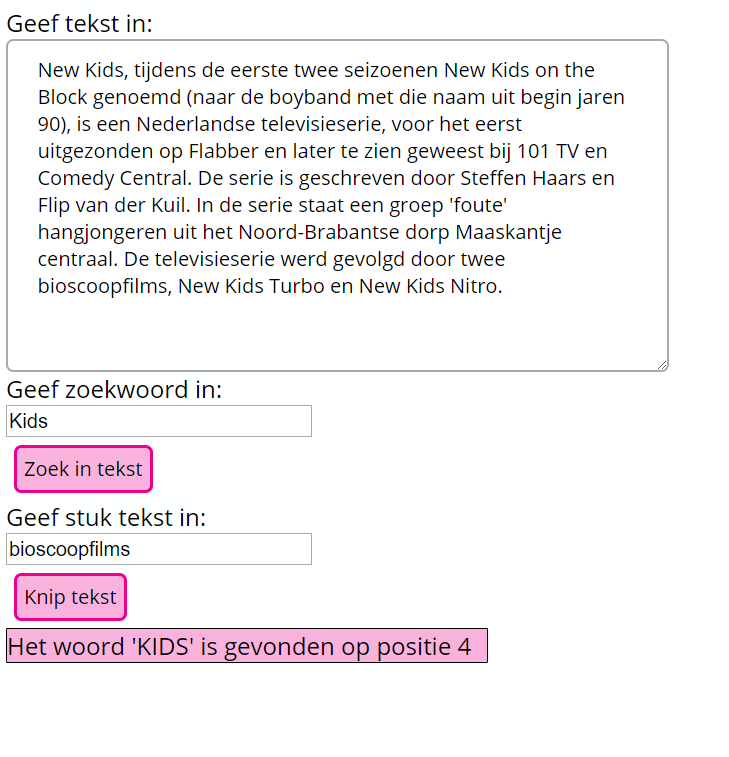
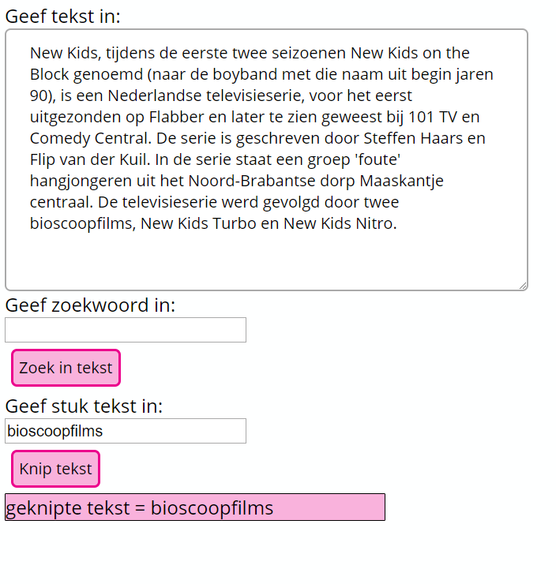

# oe-ObjectenString-Woordzoeker-Opgave

* Maak een applicatie om een woord te zoeken in een stuk tekst.
* Werk ook de functionaliteit uit om een stuk tekst te knippen uit het textarea vak
* Maak gebruik van String object methoden
* Maak gebruik van functie om de codelogica te voorzien
* Schrijf een functie Validate() die controleert of er tekst ingegeven werd

